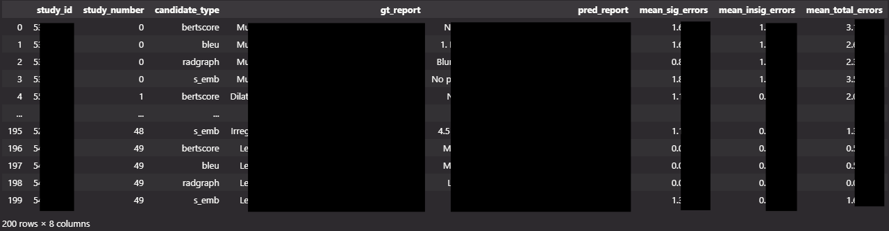

# ReXVal Preprocessor

A simple preprocessing tool for the Radiology Report Expert Evaluation (ReXVal) dataset. This package helps process and combine the radiologist error annotations with the ground truth and candidate reports.

## Overview

This tool processes two main CSV files from the REXVAL dataset:
- `50_samples_gt_and_candidates.csv`: Contains ground truth and candidate reports
- `6_valid_raters_per_rater_error_categories.csv`: Contains error annotations from radiologists

It combines these files and calculates mean error statistics per study and candidate type.

## Installation

### Requirements
- pandas

```bash
pip install pandas
```

### Data Preparation

1. Visit the [ReXVal dataset page on PhysioNet](https://physionet.org/content/rexval-dataset/1.0.0/)
2. Create a PhysioNet account and obtain credentials if you haven't already
3. Download the dataset files
4. Note the directory containing the CSV files mentioned above - this will be your `input_path`

## Usage

### Command Line Interface

```bash
python preprocess.py -i /path/to/dataset/directory -o output.csv
```

or with long options:
```bash
python preprocess.py --input_path /path/to/dataset/directory --output_path output.csv
```

### Python API

```python
from rexval_preprocessor import preprocess

# Process the dataset
df = preprocess(
    input_path="/path/to/dataset/directory",
    output_path="output.csv"
)
```

## Output

The tool generates a CSV file containing:
- Study ID and number
- Candidate type
- Ground truth and predicted reports
- Number of significant errors
- Number of insignificant errors
- Total number of errors

### Example Output

Below is an example of the preprocessed DataFrame:



## Citation

If you use this tool, please cite the original ReXVal dataset:
```
Please check the citation information at: https://physionet.org/content/rexval-dataset/1.0.0/